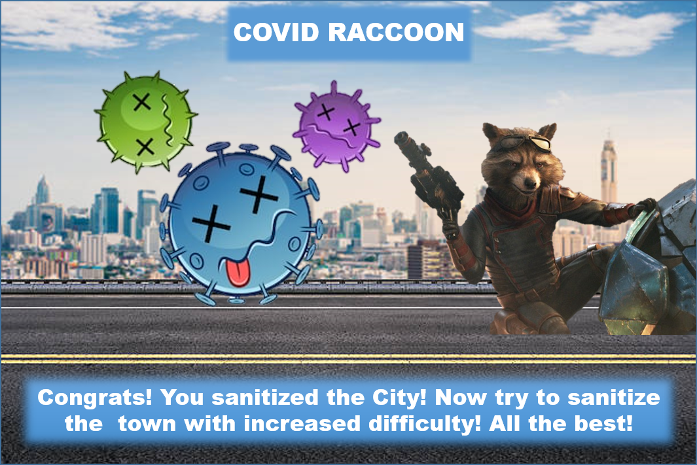

# covidRaccoon
This repository is a submission for "Raccoons Virtual Hackathon". [Hackathon Link](https://raccoons-virtual-hackathon.devpost.com/updates/12926-the-day-has-come-launching-the-raccoons)
**Youtube Video 1:** [Explains all about Pygame and the origin of the project](https://www.youtube.com/watch?v=VAwXsErtI8A)
**Youtube Video 2:** [Explains all about the attempt to implement the Game on Webserver Using JS](https://www.youtube.com/watch?v=Ri9W8guFrXI)
Would request you to watch them both to go through the entire project! Thanks... Do let me know if you have any feedbacks or questions for the same.
              
A very simple 2D game where the character jumps and dodges the viruses, infected people and bats. Further the game ends once you reach your home. Difficulty of the game can be changed by changing the virusvelocity variable.

## Installation and Setup
In order to play this game, You must ensure that you have pygame installed as your python library. In case you don't, just enter this command:

> python3 -m pip install pygame

If your default python is called out by **py** then you may try this command:

> py -m pip install pygame

Or if your default python is called out by **python** then you may try this:

> python -m pip install pygame

Note that if your pip is associated with environment variables then you may directly go with:

> pip install pygame

Once the installation is finish, either you can run it from python IDLE shell or you can manually write this script in your CMD:

> python3 PlayGame.py --diff Medium

For easy or hard mode:
> python3 PlayGame.py --diff Easy
> python3 PlayGame.py --diff Hard

**Kindly make sure your first letter of mode-type remains capital as the choices are case sensetive.**

# Covid Raccoon: Saves the Day

## Project Components
1. PyGame (Covid Raccoon:- Saves the City)
2. JS Implication (An attempt to host the game on web [Partial Success 😛])
3. [HTML Webpage](https://sedhha.github.io/covidRaccoon/) (Note that this isn't the actual game, it's just an attempt to build it on JS and host on web)

## Why Video Game Track?

What can Video Games do in our lives? Well, a typical answer will be **they are a source of fun and enjoyment.** Well, that's true, but a new generation of gaming isn't just hanging at the peak of pleasure or entertainment, but today they're also getting active in the field of learning.

Especially with a touch of AR and VR, these games can be useful in all types of learning, whether it be to train a surgeon for medical emergencies or to visualize the [__"Elephant Toothpaste Reaction"__](https://www.youtube.com/watch?v=p5qvi20J5IM) without getting worried about spillage and equipment.

## Inspiration

I have always been curious about learning new things, whether it be related to stem or something else (though, I am always inclined towards STEM). Game Dev is a booming field and seems to have a promising future if correctly used. 

Though I am well versed with other Development (App-Dev/ Web-Dev/ Designing) and Instrumentation Tech (IoT/ Robotics etc.) but Game-Dev was always something which I wanted to learn, and that's what turned me to try it here for the first time!

## What it does ?

Vs  What I did in JS using p5.js 🤣🤣🤣

- It allows you to Roam around the city, which is apparently static (unless you add your custom background :-P) and look for the virus-infected people or viruses escape them till you reach your home, which is at the end of your city.
- In this adventure, you will see different types of viruses that will try to infect you! You're a raccoon, and you're on a mission to sanitize the city without getting infected. 
- To escape from the viruses, you have to ensure that you don't come in contact with them at any cost! Also, you need to keep a distance from those who are already infected.
- Unless you're not sanitizer protected, any incoming virus can infect you. If you catch a sanitizer (which always happens), you will be able to blow it three times before it ends, and then you have to protect yourself against them.
- For all the land viruses, you need to jump and skip them. On the other hand, for all the air viruses, you need to bend down and let them pass away.
- With your speed, it takes a fixed amount of time to reach the end of the city where your sanitization process is over, and you could safely keep yourself locked unless the pandemic ends!

## How I Built It?

I started building it with pygame tutorials available on [**Youtube**](https://www.youtube.com/watch?v=i6xMBig-pP4&list=PLzMcBGfZo4-lp3jAExUCewBfMx3UZFkh5). This entire game is solely built with pygame library. The characters (in the form of png images) are prepared in Microsoft PowerPoint.

The Raccoon moving GIF was broken to extract frames by using this [**python code**](GIFtoFrames.py). So yeah, that's pretty much of it! I built it using **Python, Pygame, PowerPoint, PIL, and lots of love**!

All the Commits along with the messages linked to their respective changes have been added in github. These changes are:

- Create Readme.md
- Add License File
- Second Commit Adding Characters
- Added Walking Functionality
- Added Viruses and other graphical interfaces and also added collision Detection
- Final Modifications

## Challenges I Ran Into

If I look back, there were lots of things I struggled with such as:
- Getting Started with Pygame
- Differentiating Between **Surfaces** and **Geometries** (Rectangle:- Trust me, my first raccoon was just a box 😛)
- **Collision Detection Algorithm**: (All Credit Goes to DrawFunction in my Script, which helped me visualize the errors I was making and modify it to the best kind of collision detection)

> if RoadX>=xInit and RoadX<=xInit+CharacterSize:
        if (yTop<=RoadY+HeightVirus and yTop>=RoadY) or (yTop+CharacterSize<=RoadY+HeightVirus and yTop+CharacterSize>=RoadY):
- **Jumping Algorithm**: This one was the trickiest of all. Since it follows a parabolic trajectory, I struggled to create that realistic jump effect. And aborting the jump if I want to crouch.
> def jump(y,jumpLim,flag):
    if jumpLim==-jumpMag:
        jumpLim=jumpMag
        y=yInit
        flag=0
    else:
        y-=jumpLim*abs(jumpLim)*jumpGrowth
        jumpLim-=1
    #print(f"Jump values:{jumpLim}")
    return(y,jumpLim,flag)

- Identifying the right Entity and it's effect.
- Resetting all effects time to time.
## What I Learned ?

The very basics of Pygame, movement simulation, velocity, **blit** and **draw.rect** functions. **Time clocks, ticks, updating windows** etc. In short, Basics of a 2D Game development using Pygame.

## What's next for Covid Raccoon?

And this will produce a flow chart:

## Purpose of this Project

I have created this project mainly because of three reasons:
- **Getting Exposure of Game Development**
This project has pretty much helped me to take my first step towards Game development, slowly I would try to dive deeper and do more customizations and learn more.
- **For the Beginners and Developers**
For the Beginners and Developers who want to learn PyGame, I am planning on converting this project into **Video Tutorial Series**. This will not just be there for them to get started with PyGame but also to use this project as the base template to do the modifications in their own project.

	Pretty much every 2D game needs jump and axis movements and so if this could be any helpful to them, I would be extremely happy. I would love to see amazing games built in reference to this small project.
- **For the Kids and Babies to Develop their Minds to Generate Awareness about Cleanness and Sanetization**
This game could led to a positive awareness among the mind of kids and create a good image of importance of sanitation and hygene in maintaining their health, I am not sure how nicely it will work, but expect it to have some positive impact.

## GamePlay Images

## References
- [PyGame Tutorials](https://www.youtube.com/watch?v=i6xMBig-pP4&list=PLzMcBGfZo4-lp3jAExUCewBfMx3UZFkh5)
- [W3Schools](https://www.w3schools.com/howto/default.asp)
- [p5.js Documentation](https://p5js.org/get-started/)

## Credits
Thanks to 
- Georgijs / Raccoons/ Mentor (Helped me with feedback and mentoring throughout the Hack)
- Pauls / Mentor / Web development(opens in new tab)  (A big thanks, without him my JS game wouldn't even have started and the page would have looked like this: 😅):

- Lina / Raccoons(opens in new tab) (A big thanks to her as well for guiding with submissions and other stuff throughout the Hackathon, her workshop of Creative Computing helped me get started with JS, thanks so much for such a wonderful workshop! If the workshop wouldn't have happened then probably I wouldn't have dared to replicate this game in JS 😥)

and ofcourse all other organizers, mentors and EchoAR, I am sorry but I am still not able to figure out how to generate the Key! 😕 Or else I would have tried implementing that too!
